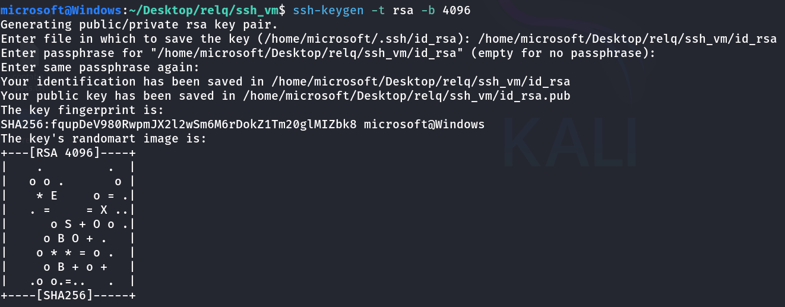
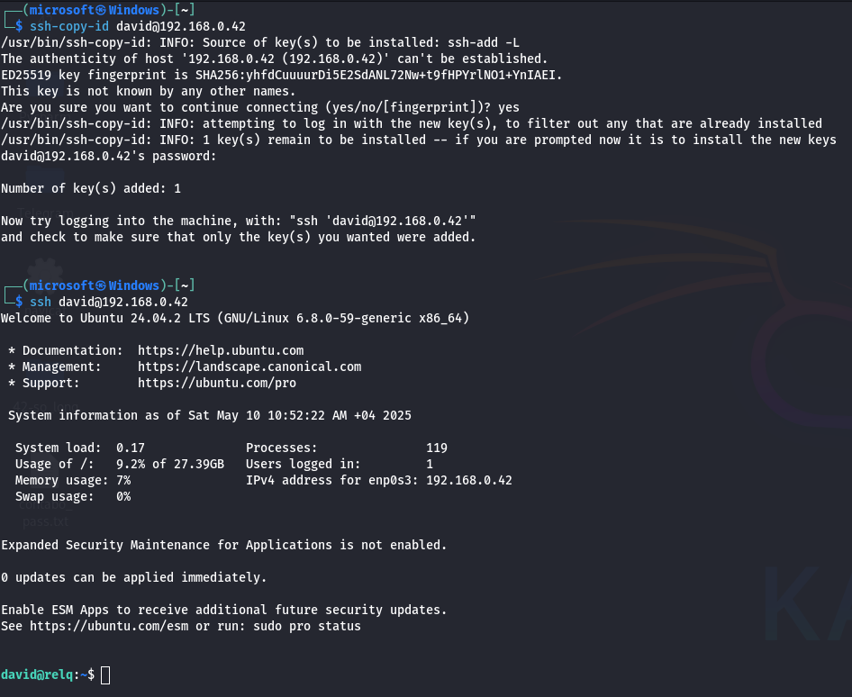
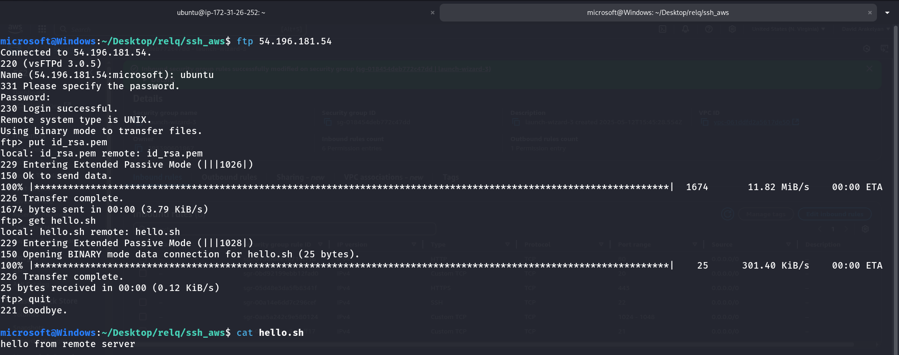
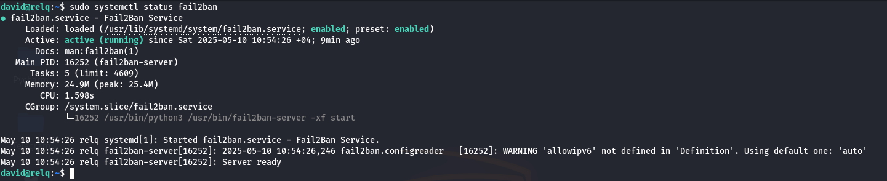
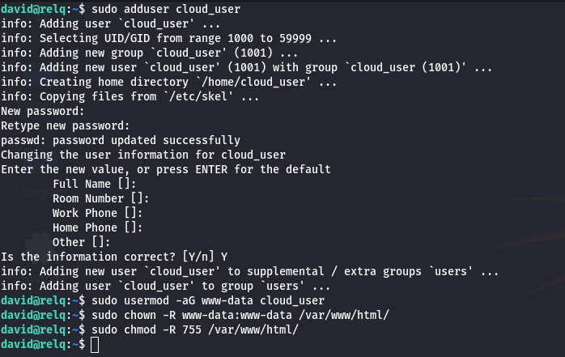

# 🚀 Local and Cloud Ubuntu Server Setup for a Startup

This project demonstrates the setup of a local and cloud-based Ubuntu server infrastructure for a startup. The servers are configured to be secure, manageable, and able to serve a simple website using NGINX. Services such as FTP, SSH, Fail2Ban, and UFW are installed and configured for secure communication and monitoring.

---

## 🧱 Part 1: Local Server Setup (VirtualBox)

### 🛠️ 1. Virtual Machine Configuration

- **Software:** `VirtualBox`  
- **OS:** `Ubuntu Server 22.04 LTS`  
- **Network:** `Bridged Adapter`
- **Base Memory:** `4 GB`
- **Storage:** `30 GB`
- **Processors:** `2`

### ✅ Setup Goals

- [x] Bridge networking for internet access  
- [x] Enable SSH with key-based authentication  
- [x] Install and test FTP server (vsftpd)  
- [x] Install and test NGINX web server  
- [x] Configure UFW (firewall) and test blocking/allowing ports  
- [x] Install Fail2Ban to protect SSH from brute-force attacks

---

## ⚙️ Installation & Configuration

### 🔐 SSH Setup with Key Authentication

```bash
sudo apt update
sudo apt install openssh-server -y
sudo systemctl enable ssh
sudo systemctl start ssh
```

#### 📌 On Client Machine:

```bash
ssh-keygen -t rsa -b 4096
ssh-copy-id server_username@server_ip
```

Edit `/etc/ssh/sshd_config`:

```bash
sudo vim /etc/ssh/sshd_config
# Update or add the following:
PasswordAuthentication no
PermitRootLogin no
```

```bash
sudo systemctl restart ssh
```

---

### 📁 FTP Server (vsftpd)

```bash
sudo apt install vsftpd -y
sudo systemctl enable vsftpd
sudo systemctl start vsftpd
```

**Configuration:**

```bash
sudo vim /etc/vsftpd.conf
# Ensure the following:
write_enable=YES
local_enable=YES
chroot_local_user=YES
anonymous_enable=NO
```

Restart:

```bash
sudo systemctl restart vsftpd
```

Test with:  
`ftp your_server_ip` or use **FileZilla**

---

### 🌐 NGINX Web Server

```bash
sudo apt install nginx -y
sudo systemctl enable nginx
sudo systemctl start nginx
```

Create or edit the HTML file:

```bash
sudo nano /var/www/html/index.html
# Add some HTML content:
<html><body><h1>Startup Server Working!</h1></body></html>
```

Visit:  
`http://your_server_ip`

---

### 🔥 UFW (Uncomplicated Firewall)

```bash
sudo ufw allow OpenSSH
sudo ufw allow 'Nginx Full'
sudo ufw enable
```

#### 🧪 Testing firewall

```bash
# Block port 80
sudo ufw deny 80

# Try to load the website — it should NOT work

# Allow port 80 again
sudo ufw allow 80
```

---

### 🛡️ Fail2Ban (IDS/IPS)

```bash
sudo apt install fail2ban -y
sudo systemctl enable fail2ban
sudo systemctl start fail2ban
```

Copy and edit configuration:

```bash
sudo cp /etc/fail2ban/jail.conf /etc/fail2ban/jail.local
sudo vim /etc/fail2ban/jail.local
```

Make sure SSH jail is enabled:

```ini
[sshd]
enabled = true
port    = ssh
filter  = sshd
logpath = /var/log/auth.log
maxretry = 3
```

Check status:

```bash
sudo fail2ban-client status
sudo fail2ban-client status sshd
```

---

## ☁️ Part 2: Cloud Server Setup and Security Management

### 📦 Cloud Details

- **Provider:** AWS EC2  
- **OS:** Ubuntu Server 22.04  
- **Domain:** (Optional)

---

### 🛠️ AWS EC2 Instance Setup

1. Launch a new EC2 instance (Ubuntu 22.04)
2. Choose instance type (e.g., t2.micro for free tier)
3. Create or use an existing key pair
4. Enable HTTP, HTTPS, FTP, and SSH in the security group
5. Connect via SSH:

```bash
ssh -i your-key.pem ubuntu@your-ec2-public-ip
```

---

### 👥 User and Role Management

```bash
# Create user
sudo adduser cloud_user

sudo usermod -aG www-data cloud_user
sudo chown -R www-data:www-data /var/www/html/
sudo chmod -R 755 /var/www/html/
```

Edit `/etc/ssh/sshd_config`:

```ini
PermitRootLogin no
PasswordAuthentication no
```

```bash
sudo systemctl restart ssh
```

### 🔐 Setup Summary

| User       | Role        | Permissions         |
|------------|-------------|---------------------|
| cloud_user | Web Manager | Limited, no sudo    |

---

## 🌍 Hosting HTML Website on Cloud

```bash
sudo nano /var/www/html/index.html
# Add simple content
<html><body><h1>Welcome to the Cloud Server!</h1></body></html>
```

```bash
sudo systemctl restart nginx
```

Visit in browser:  
`http://your_cloud_ip`

---

## 📷 Screenshots (Insert Your Own)

- [ ] Create SSH key  
  

- [ ] SSH login with key  
  

- [ ] FTP test  
  

- [ ] Website live (NGINX)  
  

- [ ] Fail2Ban  
  

- [ ] User Management
  

---

## ✅ Final Testing Table

| Feature / Test                 | Status |
|-------------------------------|--------|
| SSH key login                 | ✅     |
| FTP server working            | ✅     |
| NGINX web server online       | ✅     |
| UFW firewall tested           | ✅     |
| Fail2Ban active               | ✅     |
| Users configured with roles   | ✅     |
| HTML site hosted              | ✅     |
| AWS instance secured          | ✅     |
